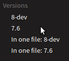

.. include::   ../../Includes.txt
.. highlight:: shell

=====================================
About The URLs
=====================================

*Summary:*

*  For extensions the generic url shows the highest TER version, which is something like
   :file:`/typo3cms/extensions/sphinx/2.4.0/` for example

*  For other manuals SOME version is actually shown for the generic URL like
   :file:`/typo3cms/Manual/`, for example :file:`/typo3cms/Manual/7.6/`,
   :file:`/typo3cms/Manual/8-dev/` or :file:`/typo3cms/Manual/latest/`.
   This is set up manually after public agreement on the server via symlink.

*  To increase clarity we are in a phase of avoiding the ambigious term "/latest/".

Manuals of TYPO3CMS Extensions
==============================

These manuals usually belong to a version that is available from
`TER, the TYPO3-Extension-Repository <https://typo3.org/extensions/repository/>`__.
Their URL will always look like this:

.. code-block:: none

   # schema:
   https://docs.typo3.org/typo3cms/extensions/EXTKEY/major.minor.patchlevel/

   # examples:
   https://docs.typo3.org/typo3cms/extensions/sphinx/2.4.0/
   https://docs.typo3.org/typo3cms/extensions/sphinx/2.3.1/
   https://docs.typo3.org/typo3cms/extensions/sphinx/2.3.0/

Additionally there is alway a version "stable" which usually is a symlink.
For extension manuals it will always point to the version with the highest
version number. The "stable" version is what you see when you leave out the
version in the URL.

So the following URLs will all show the identical version in our example:

.. code-block:: none

   https://docs.typo3.org/typo3cms/extensions/sphinx/
   https://docs.typo3.org/typo3cms/extensions/sphinx/stable/
   https://docs.typo3.org/typo3cms/extensions/sphinx/2.4.0/

Other Manuals
=============

Principles
----------

Each manual has its generic URL like

.. code-block:: none

   https://docs.typo3.org/typo3cms/CodingGuidelinesReference/

What you then actually see is version "stable" which usually is
a symlink to some version like "6.2", "7.6" or maybe "latest".

So these may all show the same version:

.. code-block:: none

   # .htaccess lets you see "stable"
   https://docs.typo3.org/typo3cms/CodingGuidelinesReference/

   # "stable" usually is a symlink, pointing for example to "latest"
   https://docs.typo3.org/typo3cms/CodingGuidelinesReference/stable/

   # "latest" actually is a real version
   https://docs.typo3.org/typo3cms/CodingGuidelinesReference/latest/

Policy for versions
-------------------

Situation and thoughts
~~~~~~~~~~~~~~~~~~~~~~

Which version will you see at the generic URL? Well, we haven't
decided on a clear policy yet. For example, you have to look at the
pages of https://docs.typo3.org/typo3cms/CodingGuidelinesReference/ to see
which version it is about. This may be especially irritating when the
manual claims to be "latest" but you don't know what "latest" actually
means. Due to historical reasons not all manuals have been up to date
and not all manuals exist in all versions of the core code.

One thing to think about is this, at least for the heavily used main reference manuals:
Should the generic URL show the latest development version or the current stable
version? Probably there isn't the ONE BEST solution for all manuals.
For example, with the release of 7.6 LTS everybody wants to find that documentation
in first place. Over time the development version "latest" becomes more and
more important.

Proposal
~~~~~~~~

As said above version selection for the generic URLs is done manually.
Let's keep that procedure until somebody has a brilliant better idea.
Let's listen to that folks expect and somewhen make the switch. If
you think it's time to do so inform the documentation team and a
coordination process will take place.

*This will remove much of the current irritation:*
Since the other day the word 'stable' isn't advertised any more.
And we are in a process of eliminating "/latest/" in the URL. Instead
it's possible to have "/x.y.z-dev/" like "/8-dev/" now.

So for example you'll see this choice, which should be pretty clear:

