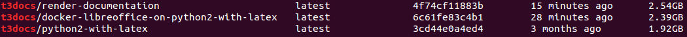

.. include::   ../../Includes.txt
.. highlight:: shell

.. _About containers:

================
About containers
================

Container `t3docs/render-documentation`
=======================================

Locations:

:Github:     https://github.com/t3docs/docker-render-documentation (1)
:Docker hub: https://hub.docker.com/r/t3docs/render-documentation/ (2)

(1) is the recipe for building the Docker image. We maintain just one version
of that container that is capable of doing all the tasks. The downside is that
it requires a big initial download of more than >2.5 GB.

Restructured!
-------------

2017-11-25 News from the TYPO3 Server Team Sprint

We now have three layers:

   What Docker tells about t3docs images.

1. `python2 <https://hub.docker.com/_/python/>`__ is one of the base images
   available from Docker hub.

2. `python2 with latex <https://hub.docker.com/r/t3docs/python2-with-latex/>`__
   is a self-defined image. It mainly adds the Debian
   package 'lexlive'. It's the biggest one but usually doesn't change.

3. `libreoffice on python2 with latex
   <https://hub.docker.com/r/t3docs/docker-libreoffice-on-python2-with-latex/>`__
   is self-defined and rather large as well. It usually will not change.

4. `t3docs/render-documentation
   <https://hub.docker.com/r/t3docs/render-documentation/>`__ - this is the
   actual workhorse. And this is the image that is likely to change often. But
   luckily, since it builds upon image (3.) the download size of an update will
   be relatively small. It is around 150 Mb at the moment.

**Summary:**

-  Prepare for a BIG initial download::

      # run the command for the first time
      # fetches everything (around 2.5 GB)

      docker pull t3docs/render-documentation

-  Down be afraid of subsequent updates - they should be relatively small::

      # run the command again
      # fetches only changes (for example 150 MB)

      docker pull t3docs/render-documentation

   Why?

   Docker is 'clever'. It adds the layers at runtime and only downloads what
   has changed.

Enjoy and give it a try. It is "cool stuff" AND very useful as well!